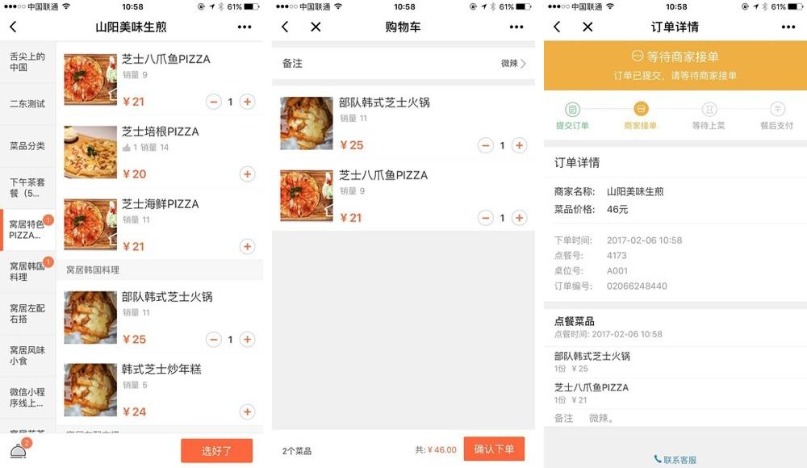
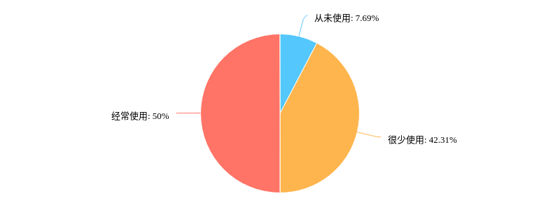
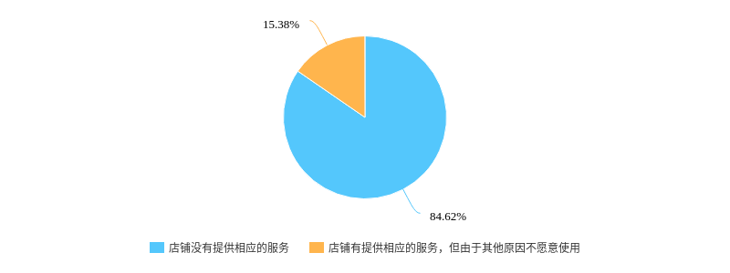
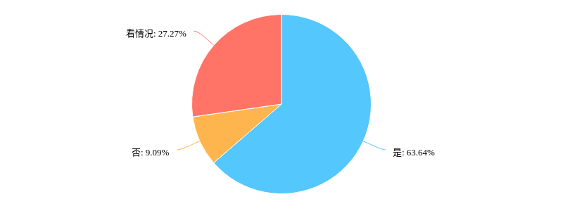
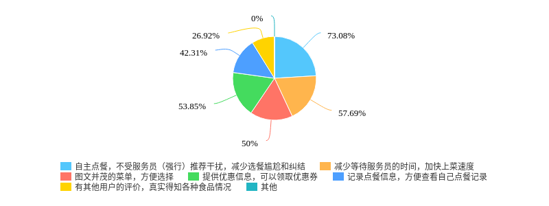
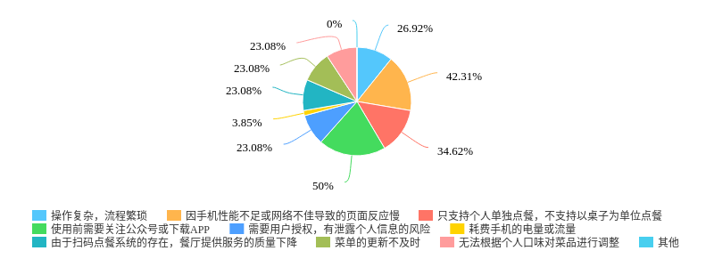
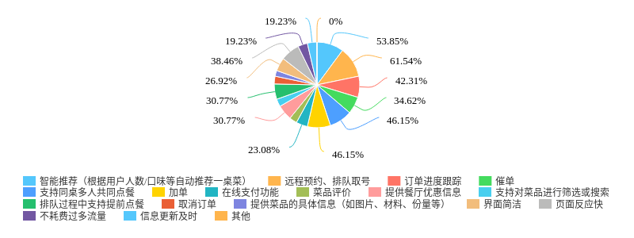

# 初步调研
## 相关产品与发展综述
去年三月，三个辣椒牛肉粉在广州推出了全国首家小程序版的“微信支付旗舰店”，用小程序替换了原来在公众号上搭载的H5点餐服务，还在小程序中融合了“微信会员卡”能力。
“三个辣椒牛肉粉”丽影广场店用小程序替换H5点餐服务后，每天约70%的订单来自小程序，门店订单数量及营业额与以往相比也有较大提升。

## 值得关注的竞争产品，及其竞争优势
- 点单宝
  - 会员系统
  - 支持微信排队
  - 支持外卖系统
  - 对商家友好，管理平台报表精细化

- 创匠
  - 支持加菜、退菜
  - 支持加人换桌
  - 支持多人点餐
  - 会员系统
  - 适合分店管理，财务、查账、对账、报表都很精细
  - 老板可以实时查询店铺经营状态

## 相关产品的市场（客户）定位
产品主要针对线下中小型餐饮商家，如快餐连锁，甜品奶茶店，火锅店，小吃店。

## 某个产品的典型业务实现的过程，核心界面
扫码点餐业务过程：
1、在每一个桌位上放上专属的小程序参数码，而专属的小程序码则对应相应的桌号，消费者到店后扫码进入小程序点餐；
2、确认之后，在前台和后台的小票上，消费者所点的菜名以及对应的餐桌位号都能同步显示出来；
3、用户可选择直接在线上微信支付，也可以到收银台选择其他方式结账；
4、如需加菜，重复以上动作。

核心界面：

## 可能存在的新机遇
1、目前小程序普遍缺少远程预约、排队取号功能，我们打算在自己的产品中实现该功能

2、AI近年很热，打算根据用户以往订单历史智能推荐菜品

# 针对用户的调研结果分析
通过[调查问卷](https://www.wjx.cn/jq/22053042.aspx)形式收集了近100位学生的数据，针对人们对点餐小程序的接受程度以及期望进行分析结果如下：

|使用情况：一半用户没/很少使用|很少使用的原因：绝大部分商家没有提供小程序|对点餐小程序接受情况：超过一半人愿意使用|
|:---:|:---:|:---:|
||||

|用户喜欢点餐小程序的原因：①不受服务员干扰而且减少等待服务员的时间 ②图文并茂，而且有其他用户的真实评价|
|:---:|
||

|用户对当前一些点餐程序不满意的方面：①页面交互反应慢 ②极少支持多人同时点餐 ③捆绑公众号营销|
|:---:|
||

|用户最期待的功能： ①远程预约、排队取号 ②智能推荐 ③支持同桌多人点餐、加单 ④订单跟踪|
|:---:|
||

|支付方式：以在线支付为主，线下支付为辅|
|:---:|
||

# 产品初步建议

产品定位：中小型餐饮类商家

基本功能：

- 面向顾客
  - 自主点菜
  - 跟踪订单
  - 加单
  - 催单
- 面向商家(待商议)
  - 管理菜品
  - 管理订单
  - 管理桌位
  - 查看收支

特色功能：
- 远程预约、排队取号(必须实现，待确定交互流程)
- 同桌多人点餐(争取实现)
- 智能推荐(争取实现)

