# Use Cases

- [扫码点餐系统](#扫码点餐系统)
  - [1. 扫码用例](#1-扫码用例)
  - [2. 查看商家信息用例](#2-查看商家信息用例)
  - [3. 查看用户评价用例](#3-查看用户评价用例)
  - [4. 管理购物车用例](#4-管理购物车用例)
  - [5. 点菜用例](#5-点菜用例)
  - [6. 结算用例](#6-结算用例)
  - [7. 查看订单用例](#7-查看订单用例)
- [商家后台管理系统](#商家后台管理系统)
  - [1. 登录注册用例](#1-登录注册用例)
  - [2. 管理菜单用例](#2-管理菜单用例)
  - [3. 管理订单用例](#3-管理订单用例)

## 扫码点餐系统

### 1. 扫码用例  

用户通过微信扫码，进入点餐微信小程序  

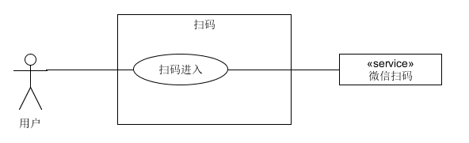

### 2. 查看商家信息用例  

用户通过点击点餐小程序首页的`商家`标签，进入商家信息界面，查看商家相关信息。商家信息包括商家地址、联系电话、食品安全档案（许可证、营业执照）、营业时间、本店优惠活动等。  

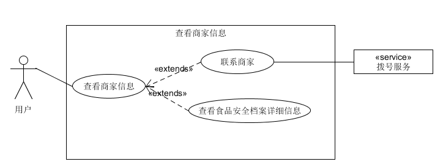

### 3. 查看用户评价用例

用户通过点击小程序首页的`评价`标签进入评价信息页面。包含商家的各方面评分（商家评分、口味评分、配送评分等），还包含所有用户写下的评价。同时，评价还有不同的标签分类，可以查看不同类别的评价信息。  

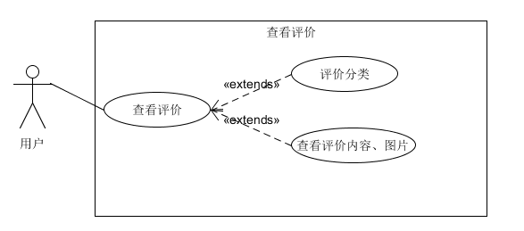  

### 4. 管理购物车用例  

用户在菜品列表中选择的菜品会被添加到用户的购物车中，用户可以通过点击左下角的购物车图标来管理自己的购物车。可以清空自己的购物车，也可以对已点菜品进行数量的修改。  

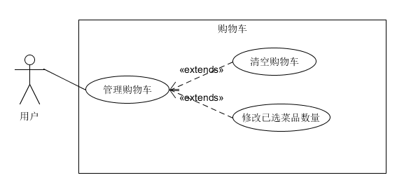

### 5. 点菜用例

用户在小程序的首页可以进行点菜。选择不同的菜品分类，查看该分类下的所有菜品，点击列表中的任一菜品来查看该菜品的详细信息。通过菜品栏右边的加号将想要的
菜品加入购物车，通过‘+’、‘-’号修改想要的数量。  

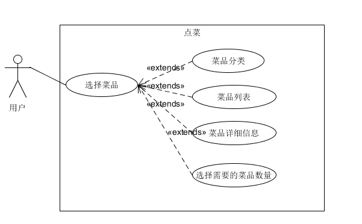

### 6. 结算用例

用户选完菜后，可以通过右下角的结算按钮来进行订单提交、支付等操作。提交订单时需要选择希望送达时间、支付方式、餐具数量。

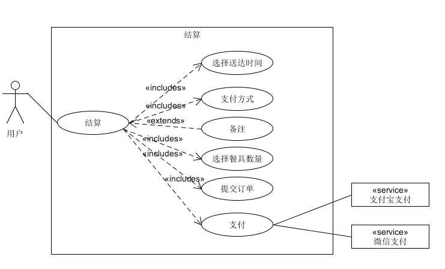

### 7. 查看订单用例

用户可以查看自己的订单信息  

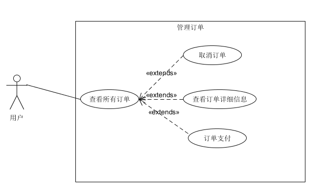

## 商家后台管理系统

### 1. 登录注册用例

商家用户在注册、登录账号后进入管理系统

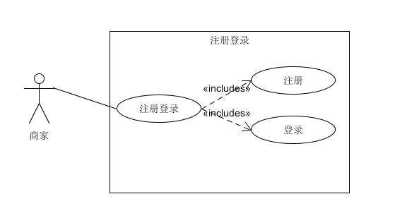

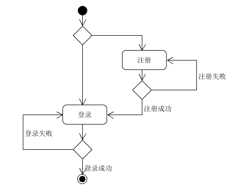

### 2. 管理菜单用例

商家用户对商品进行查看、添加、删除

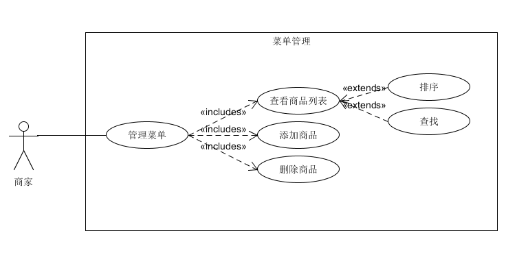

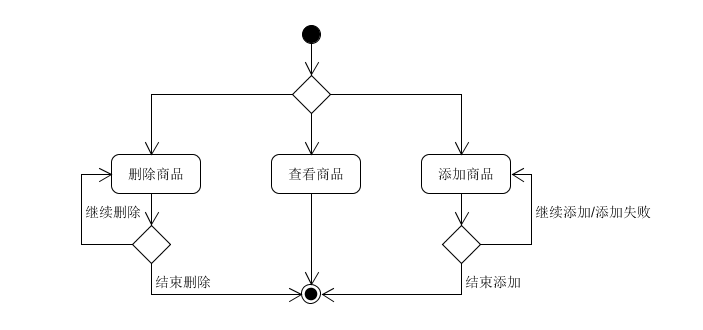

### 3. 管理订单用例

商家用户在订单列表下可以对订单进行处理，处理完订单仍然处于订单列表界面

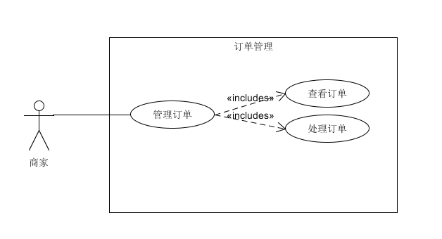

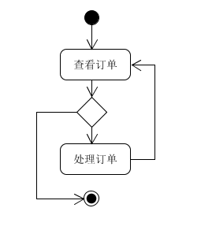