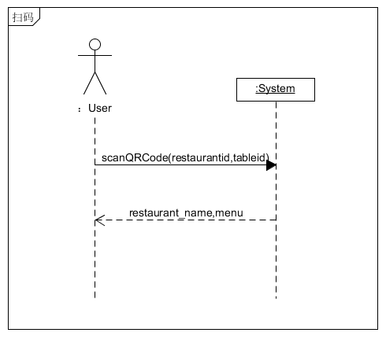
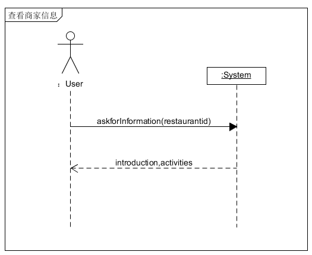
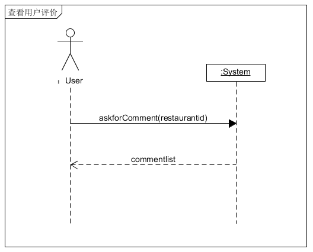
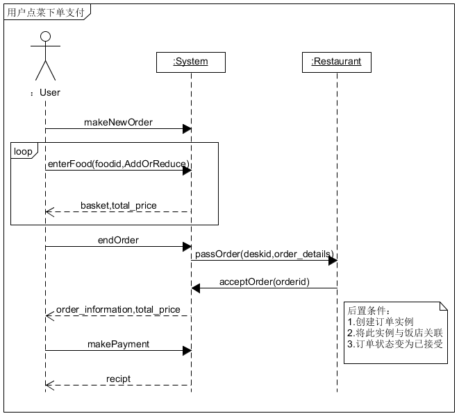
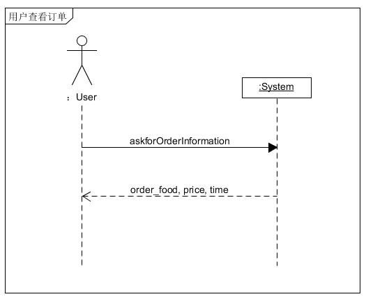
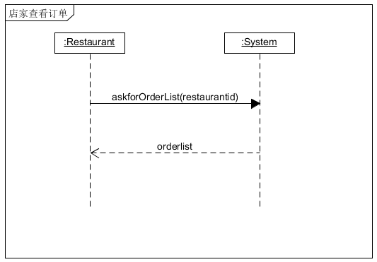
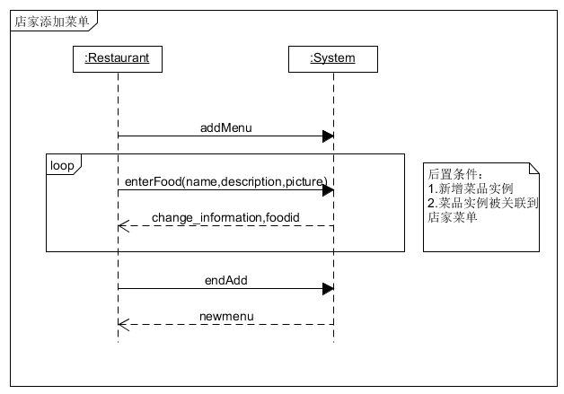
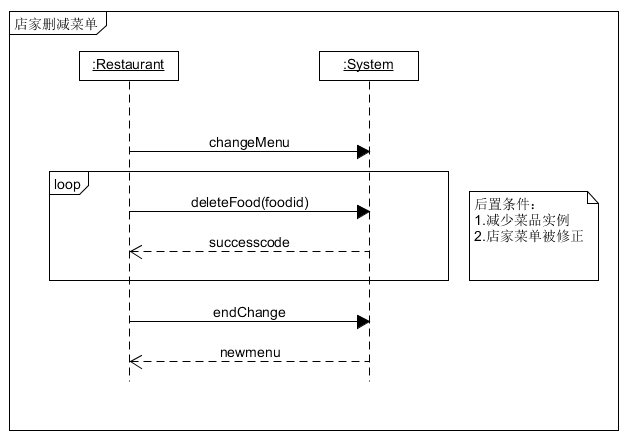

# System Sequence Diagrams

- [扫码点餐系统](#扫码点餐系统)
  - [1. 扫码系统顺序图](#1-扫码系统顺序图)
  - [2. 查看商家信息系统顺序图](#2-查看商家信息系统顺序图)
  - [3. 查看用户评价系统顺序图](#3-查看用户评价系统顺序图)
  - [4. 用户点菜下单支付系统顺序图](#4-用户点菜下单支付系统顺序图)
  - [5. 用户注册系统顺序图](#5-用户注册系统顺序图)
  - [6. 用户登录系统顺序图](#6-用户登录系统顺序图)
  - [7. 用户查看订单系统顺序图](#7-用户查看订单系统顺序图)
- [商家后台管理系统](#商家后台管理系统)
  - [1. 商家注册系统顺序图](#1-商家注册系统顺序图)
  - [2. 商家登录系统顺序图](#2-商家登录系统顺序图)
  - [3. 商家生成小程序码系统顺序图](#3-商家生成小程序码系统顺序图)
  - [4. 商家查询历史订单系统顺序图](#4-商家查询历史订单系统顺序图)
  - [5. 商家查看现有订单系统顺序图](#5-商家查看现有订单系统顺序图)
  - [6. 商家添加菜单系统顺序图](#6-商家添加菜单系统顺序图)
  - [7. 商家删减菜单系统顺序图](#7-商家删减菜单系统顺序图)

## 扫码点餐系统

### 1. 扫码系统顺序图
（15331098）

用户通过微信扫码，进入点餐微信小程序  

### 2. 查看商家信息用例系统顺序图
（15331098）

用户通过点击点餐小程序首页的`商家`标签，进入商家信息界面，查看商家相关信息。商家信息包括商家地址、联系电话、食品安全档案（许可证、营业执照）、营业时间、本店优惠活动等。  

### 3. 查看用户评价系统顺序图
（15331098）

用户通过点击小程序首页的`评价`标签进入评价信息页面。包含商家的各方面评分（商家评分、口味评分、配送评分等），还包含所有用户写下的评价。同时，评价还有不同的标签分类，可以查看不同类别的评价信息。  

  

### 4. 用户点菜下单支付系统顺序图
（15331098）

用户在小程序的首页可以进行点菜。选择不同的菜品分类，查看该分类下的所有菜品，点击列表中的任一菜品来查看该菜品的详细信息。通过菜品栏右边的加号将想要的
菜品加入购物车，通过‘+’、‘-’号修改想要的数量。  
用户选完菜后，可以通过右下角的结算按钮来进行订单提交、支付等操作。提交订单时需要选择希望送达时间、支付方式、餐具数量。

### 5. 用户注册系统顺序图

### 6. 用户登录系统顺序图

### 7. 用户查看订单系统顺序图
（15331098）

用户可以查看自己的订单信息  

## 商家后台管理系统

### 1. 商家注册系统顺序图

### 2. 商家登录系统顺序图

### 3. 商家生成小程序码系统顺序图

### 4. 商家查询历史订单系统顺序图

### 5. 商家查看现有订单系统顺序图
（15331098）

商家可以查看目前有什么订单等待完成。

### 6. 商家添加菜单系统顺序图
（15331098）

商家可以修改其饭店菜单，添加新菜品。

### 7. 商家删减菜单系统顺序图
（15331098）

商家可以删除菜单上的菜品。

