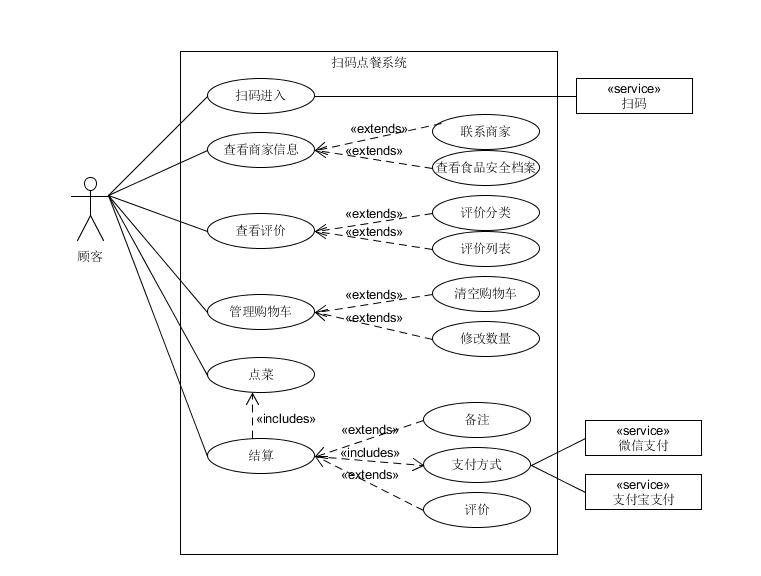

# 用户用例图

  

* 扫码进入：用户通过微信扫一扫扫描二维码进入到点餐界面

* 查看商家信息：用户可以查看商家的联系方式以及食品安全档案各种商家信息

* 查看评价：用户可以选择不同的评价分类查看评价

* 点菜：用户在菜品列单中选择自己需要的菜品以及数量，添加的菜品会被加入到购物车

* 管理购物车：用户可以在购物车里对已选择的菜品进行数量修改，或是清空购物车重新进行点菜

* 结算：用户在结算界面会有订单的详细内容，并可以对订单添加备注，在选择支付方式并完成支付后，用户可以对此次体验进行评价