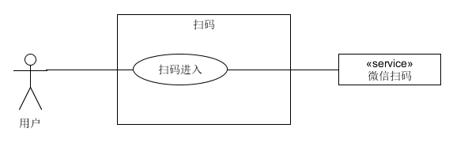
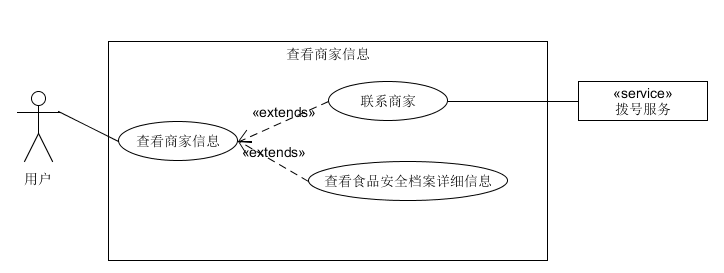
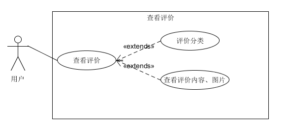
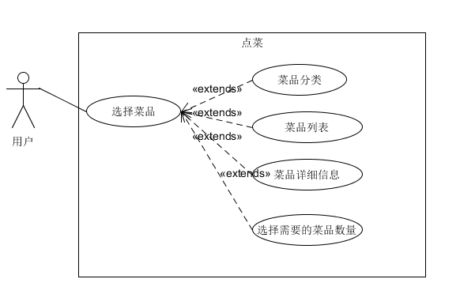
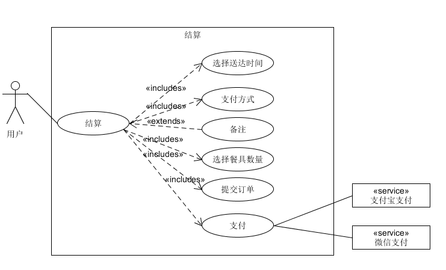
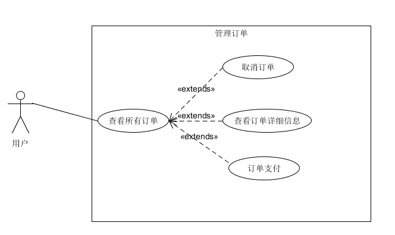

# Use Cases
## 1. 扫码用例  
用户通过微信扫码，进入点餐微信小程序  

## 2. 查看商家信息用例  

用户通过点击点餐小程序首页的`商家`标签，进入商家信息界面，查看商家相关信息。商家信息包括商家地址、联系电话、食品安全档案（许可证、营业执照）、营业时间、本店优惠活动等。  

## 3. 查看用户评价用例

用户通过点击小程序首页的`评价`标签进入评价信息页面。包含商家的各方面评分（商家评分、口味评分、配送评分等），还包含所有用户写下的评价。同时，评价还有不同的标签分类，可以查看不同类别的评价信息。  

  

## 4. 管理购物车用例  

用户在菜品列表中选择的菜品会被添加到用户的购物车中，用户可以通过点击左下角的购物车图标来管理自己的购物车。可以清空自己的购物车，也可以对已点菜品进行数量的修改。  

  

## 5. 点菜用例

用户在小程序的首页可以进行点菜。选择不同的菜品分类，查看该分类下的所有菜品，点击列表中的任一菜品来查看该菜品的详细信息。通过菜品栏右边的加号将想要的
菜品加入购物车，通过‘+’、‘-’号修改想要的数量。  

  

## 6. 结算用例

用户选完菜后，可以通过右下角的结算按钮来进行订单提交、支付等操作。提交订单时需要选择希望送达时间、支付方式、餐具数量。

## 7. 查看订单用例

用户可以查看自己的订单信息  

