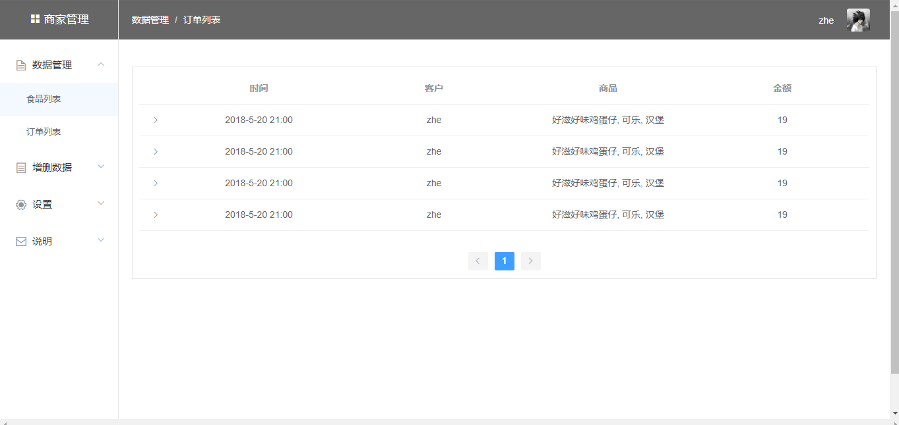
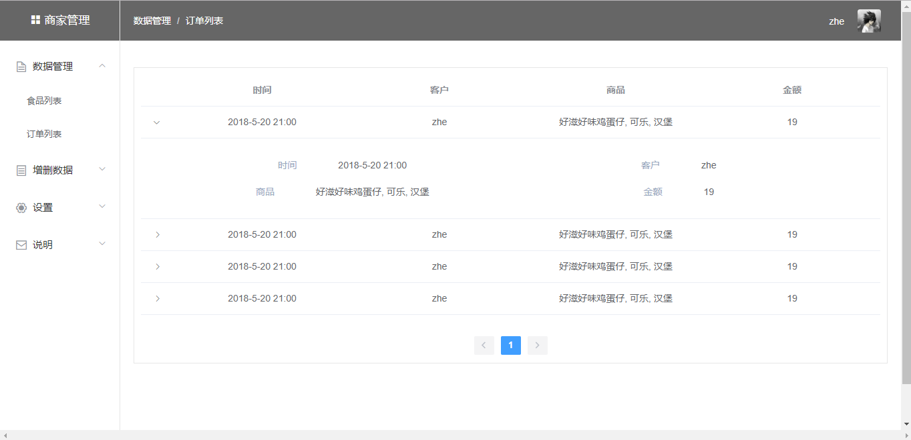
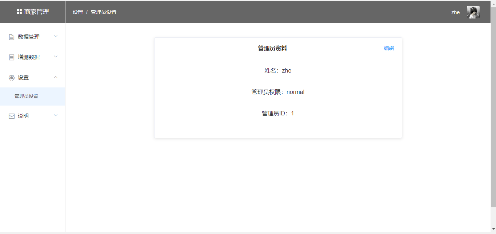

## UI设计

商家后台管理系统UI界面，包括

* [登录注册界面](#登录注册界面)
* [数据管理界面](#数据管理界面)
* [增删数据界面](#增删数据界面)
* [设置界面](#设置界面)
* [说明界面](#说明界面)

### 登录注册界面：

商家系统登录注册界面，可以选择登录已有账号或注册新账号

### 数据管理界面

#### 食物列表

在完成登录后，跳转到食物列表界面，食物列表中每一项有食物的名称、id、类别、价格、详情介绍以及图片

#### 订单列表

点击菜单栏里数据管理条目下拉的订单列表，跳转到订单列表界面

订单列表有所有提交的订单，每个订单显示时间、客户、商品、金额

点击订单列表的每一项，会出现下拉显示框，显示订单的详细信息，包括时间、客户、商品、金额

### 增删数据界面

#### 增加商品

点击菜单栏里增删数据条目下拉的添加商品，跳转到添加商品界面。添加商品界面对商品信息进行补充，包括食品种类、食品名称、食品详情、食品图片、价格

#### 删除商品

点击菜单栏里增删数据条目下拉的删除商品，跳转到删除商品界面。删除商品界面显示商品列表，每一个商品条目包括商品id、名称、描述、价格，点击删除按钮可以对每个条目进行删除

### 设置界面

点击菜单栏设置条目下拉的管理员，跳转到管理员设置界面，可以对管理员资料编辑

### 说明界面

点击菜单栏说明条目下拉的具体说明，跳转到系统说明界面

