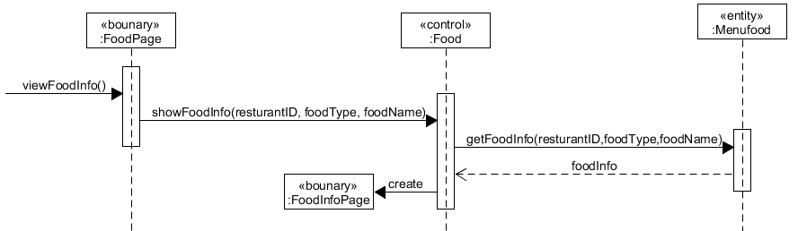

# 用例设计
<!-- TOC -->

- [用例设计](#用例设计)
    - [客户扫码点餐系统](#扫码点餐系统)
        - [查看商家信息用例](#查看商家信息用例)
        - [查看用户评价用例](#查看用户评价用例)
        - [管理购物车用例](#管理购物车用例)
        - [点菜用例](#点菜用例)
        - [提交订单用例](#提交订单用例)
        - [管理订单用例](#管理订单用例)

<!-- /TOC -->

## 扫码点餐系统

### 查看商家信息用例

+ 用例简述：用户通过点击点餐小程序首页的商家标签，进入商家信息界面，查看商家相关信息。  

+ 顺序图

+ 类图

### 查看用户评价用例

+ 用例简述：用户通过点击小程序首页的评价标签进入评价信息页面。包含商家的各方面评分（商家评分、口味评分、配送评分等），还包含所有用户写下的评价。

+ 顺序图

+ 类图

### 管理购物车用例

+ 用例简述：用户在菜品列表中选择的菜品会被添加到用户的购物车中，用户可以通过点击左下角的购物车图标来管理自己的购物车。可以清空自己的购物车，也可以对已点菜品进行数量的修改。

+ 顺序图

+ 类图

### 点菜用例

+ 用例简述：用户在小程序的首页可以进行点菜。选择不同的菜品分类，查看该分类下的所有菜品，点击列表中的任一菜品来查看该菜品的详细信息。通过菜品栏右边的加号将想要的 菜品加入购物车，通过‘+’、‘-’号修改想要的数量。

+ 顺序图

+ 类图

### 提交订单用例

+ 用例简述：用户选完菜后，可以通过右下角的结算按钮来进行订单提交、支付等操作。提交订单时需要选择希望送达时间、支付方式、餐具数量。

+ 顺序图

+ 类图

### 管理订单用例

+ 用例简述：用户可以查看自己的所有订单，取消订单或进行支付。

+ 顺序图

+ 类图
