# 用例设计
<!-- TOC -->

- [用例设计](#用例设计)
    - [商家后台管理系统](#商家后台管理系统)
        - [注册用例](#注册用例)
        - [登录用例](#登录用例)
        - [查看订单列表用例](#查看订单列表用例)
        - [查看商品列表用例](#查看商品列表用例)
        - [增加商品用例](#增加商品用例)
        - [删除商品用例](#删除商品用例)
        - [管理员设置用例](#管理员设置用例)

<!-- /TOC -->

## 商家后台管理系统

### 注册用例

用户在注册界面填写注册信息，提交后根据是否成功注册分情况返回注册成功和注册失败界面

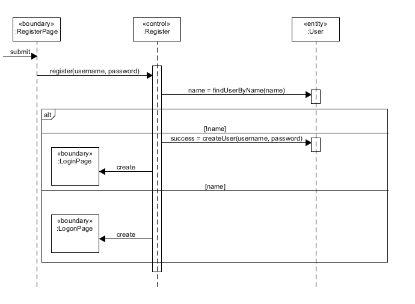

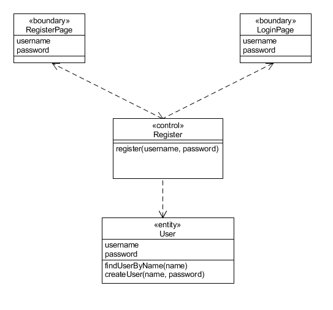

### 登录用例

用户在登录界面填写账号密码，提交后根据是否成功登录分情况返回登录成功和登录失败界面

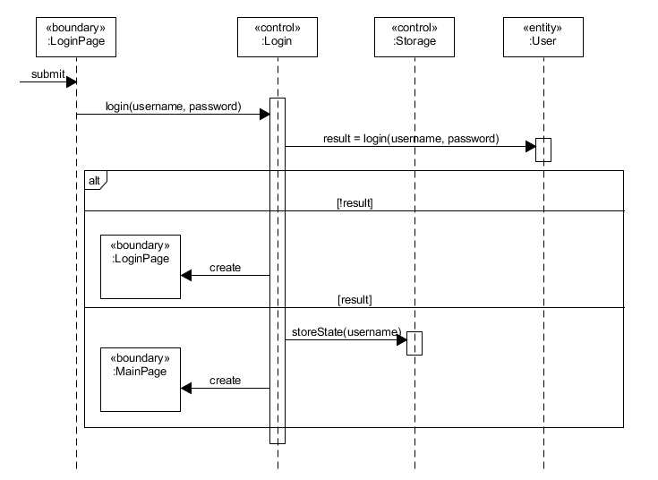

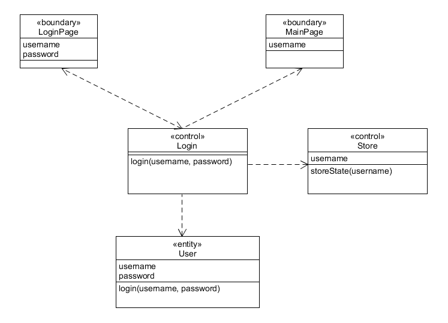

### 查看订单列表用例

用户在主界面点击菜单栏订单列表，系统显示订单列表

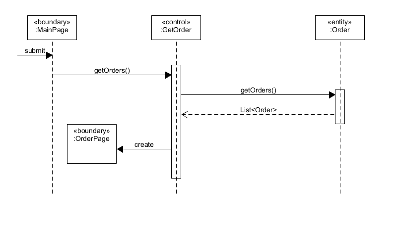

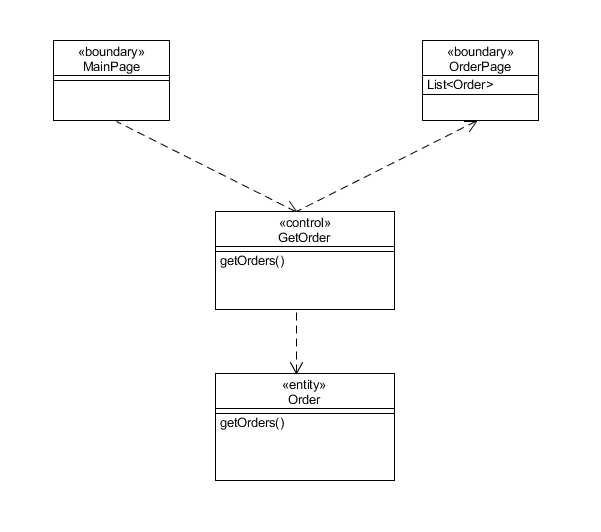

### 查看商品列表用例

用户在主界面点击菜单栏食品列表，系统显示食品列表

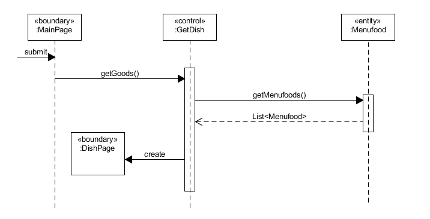

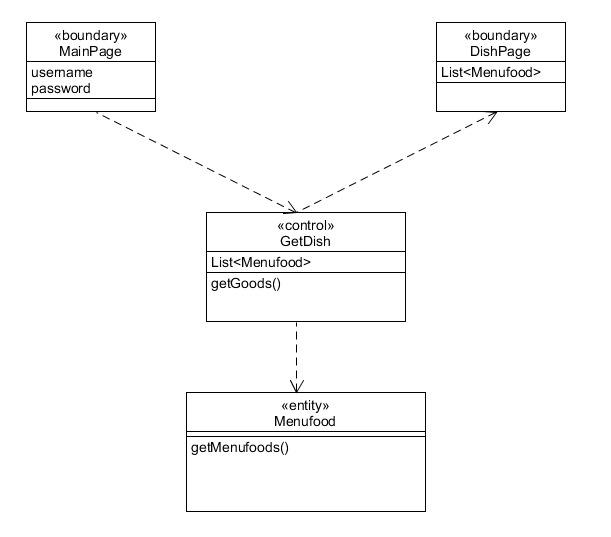

### 增加商品用例

用户在主界面点击菜单栏的增加商品，系统显示订单增加商品界面。在增加商品界面填写添加的商品信息后提交,根据是否成功添加分情况返回添加成功和添加失败界面

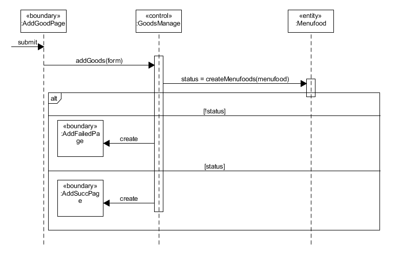

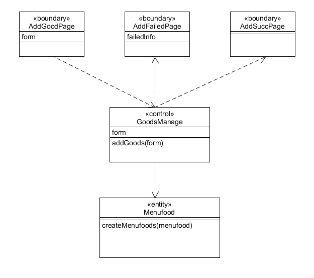

### 删除商品用例

用户在主界面点击菜单栏的删除商品，系统显示订单增加删除商品界面。在删除商品请求提交后,返回删除商品界面

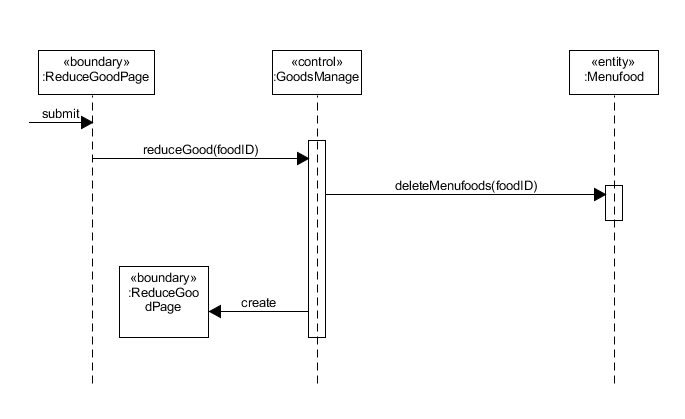

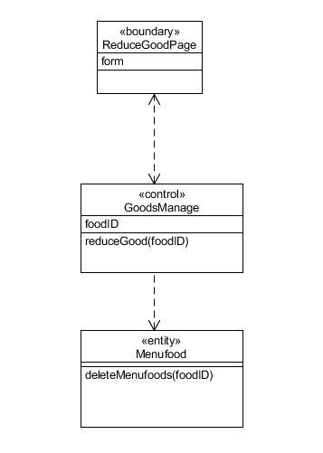

### 管理员设置用例

用户在主界面点击菜单栏的管理员设置，系统显示管理员信息界面

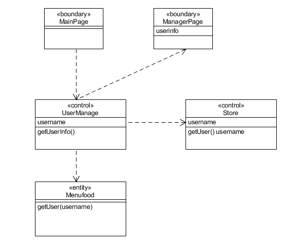

用户在管理员信息界面点击编辑信息，系统显示管理员信息编辑界面，完成编辑提交后返回到管理员信息界面

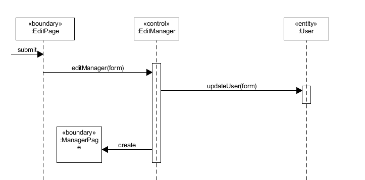

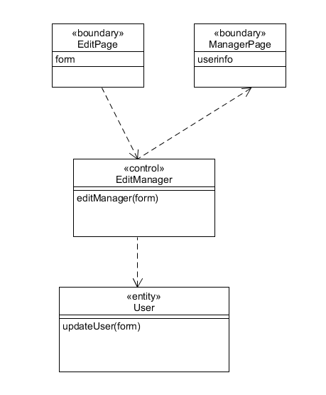