# 随心点餐宝用户手册

## 商家使用说明

### 1. 注册

使用随心点餐宝前需要有个管理员账号，输入用户名和密码注册你的账号（同一用户名只能注册一个账号）。如果有账号，请直接登录

（注：请妥善保管你的用户名和密码）

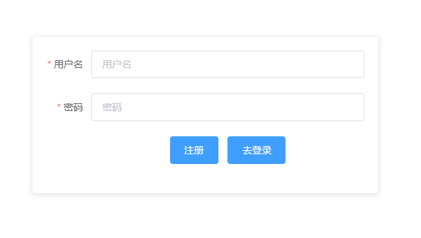

### 2. 登录

输入你账号的用户名和密码登录

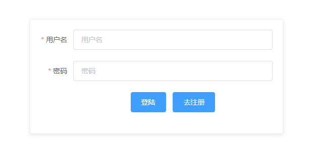

### 3. 信息修改

点击左边管理员设置，可查看当前管理员信息。点击修改可修改你的账号信息，注意ID不能与其它管理员发生冲突

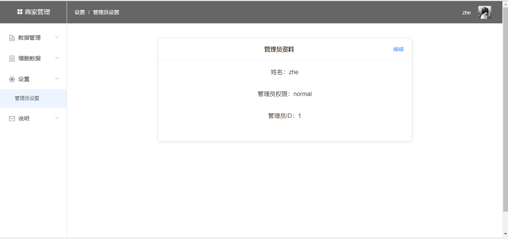

### 4. 订单

#### 4.1. 查看全部订单

点击【数据管理->订单列表，可查看所有订单信息

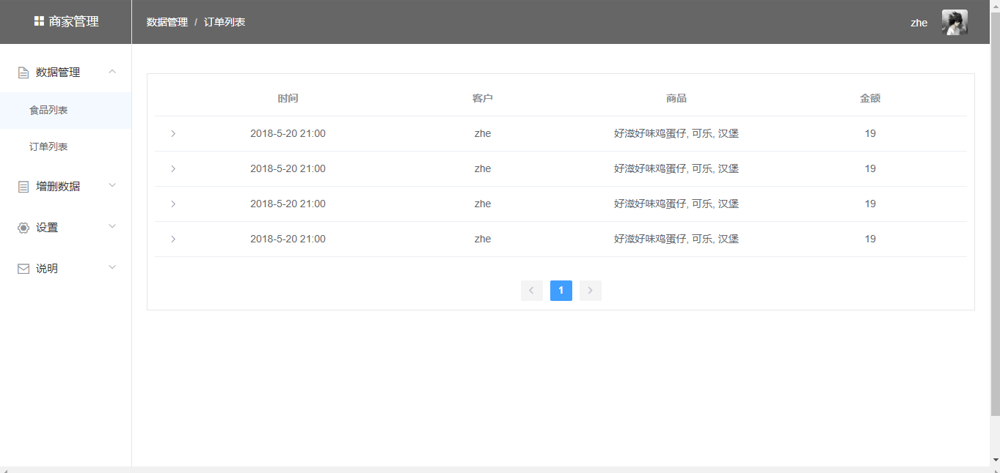

#### 4.2. 订单详情

点击某一订单，可查看订单详细内容

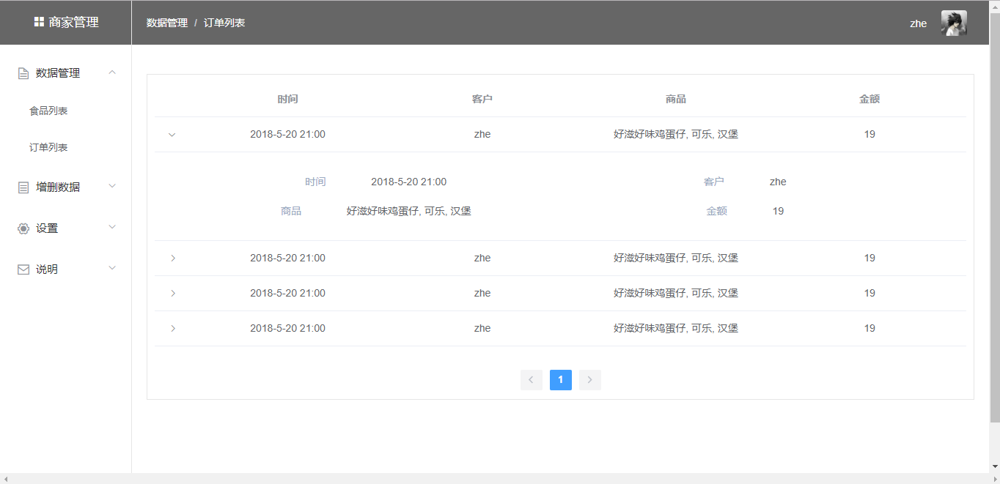

### 5. 商品

#### 5.1. 查看商品

点击【数据管理->食物列表，可查看所有商品信息

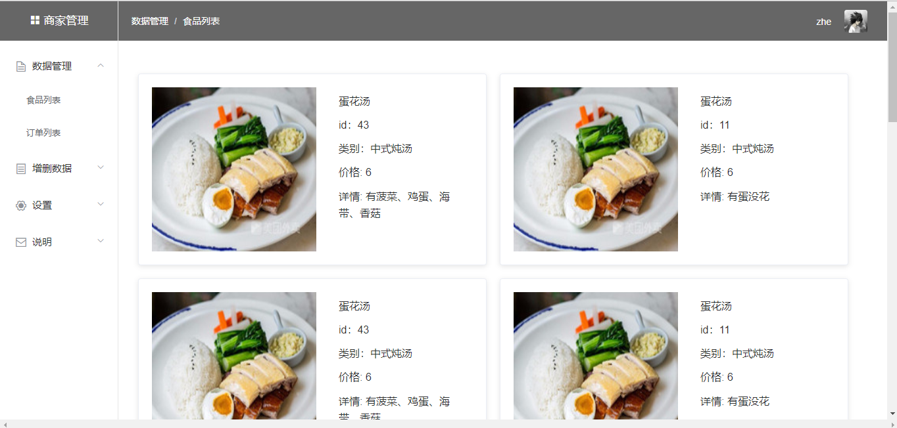

#### 5.2. 删除商品

点击【增删数据->删除商品，在具体商品行点击删除，可删除该商品

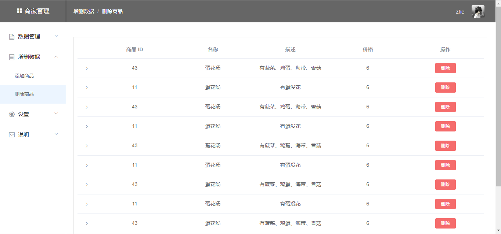

#### 5.3. 添加商品

点击【增删数据->添加商品，填写商品具体信息后，可增加商品，注册该商品名字不能与已存在商品名字相同

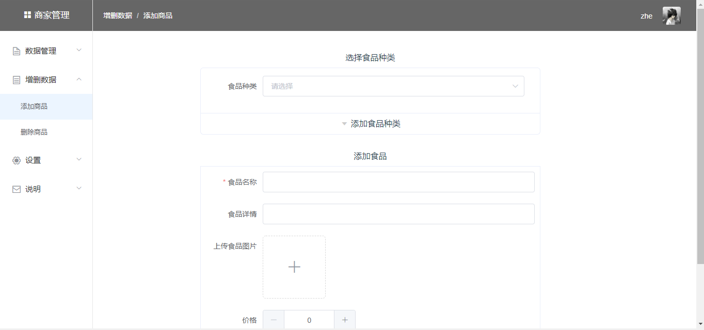

### 6. 说明

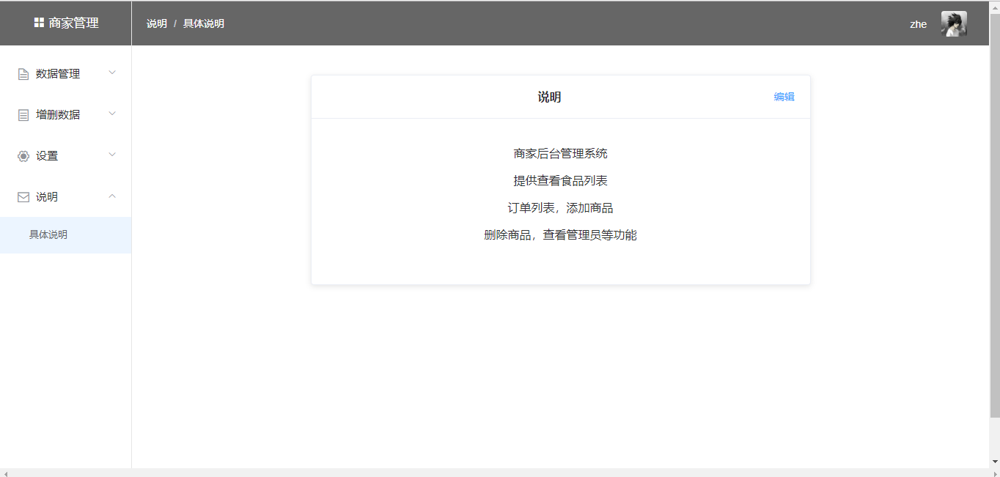

## 顾客使用说明

### 1. 点菜界面

#### 1.1. 查看类别一

点击【中式炖汤，可以查看该种类所拥有的商品

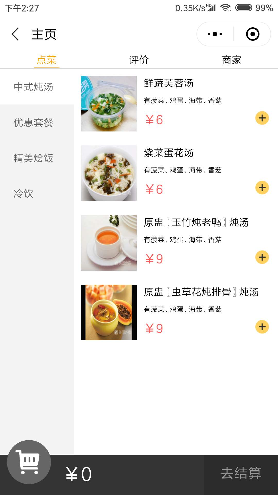

#### 1.2. 查看类别二

点击【优惠套餐，可以查看该种类所拥有的商品

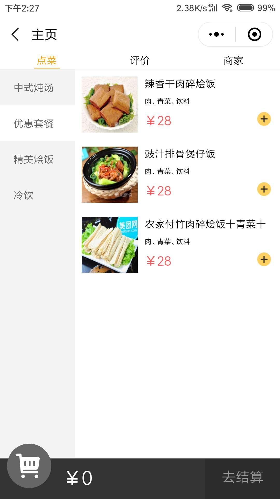

### 2. 查看商品详情

直接点击该商品，则可查看商品的详情

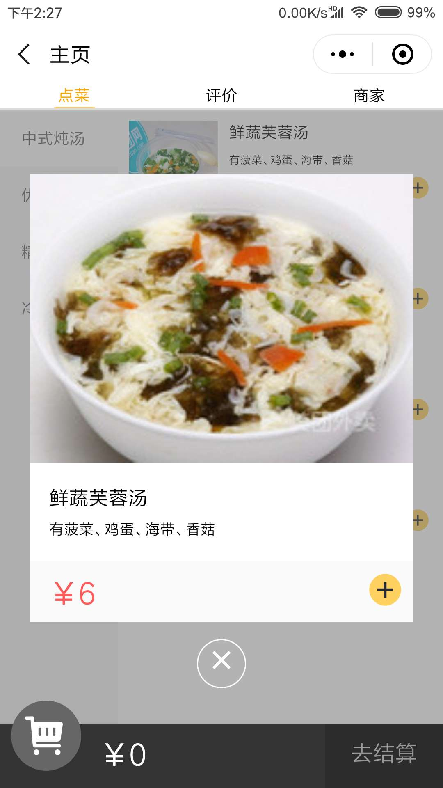

### 3. 添加商品

点击点菜界面的【“+”，或者商品详情界面的【“+”，都能将该商品添加到购物车中，数目为1

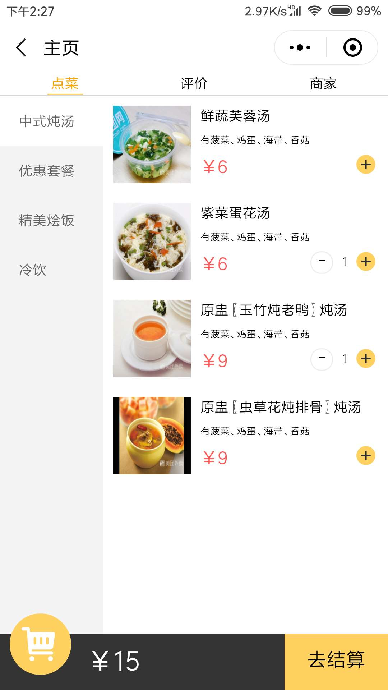

### 4. 删除商品

点击购物车界面的【“-”，或者是点菜界面的【“-”，都能将该商品个数减少1

点击【清空购物车，能直接清空购物车

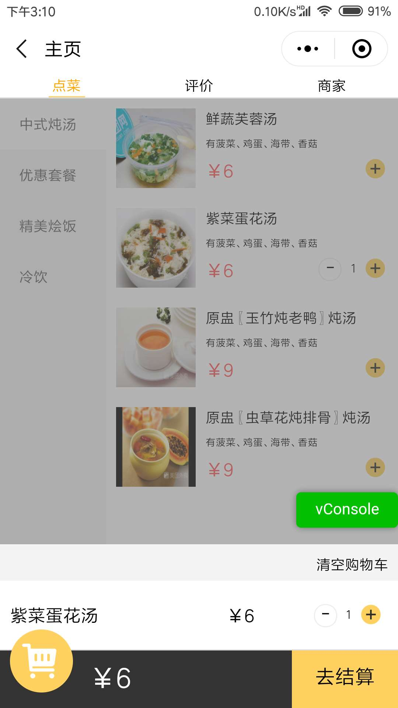

### 5. 查看购物车

点击左下购物车图标，能查看购物车内容

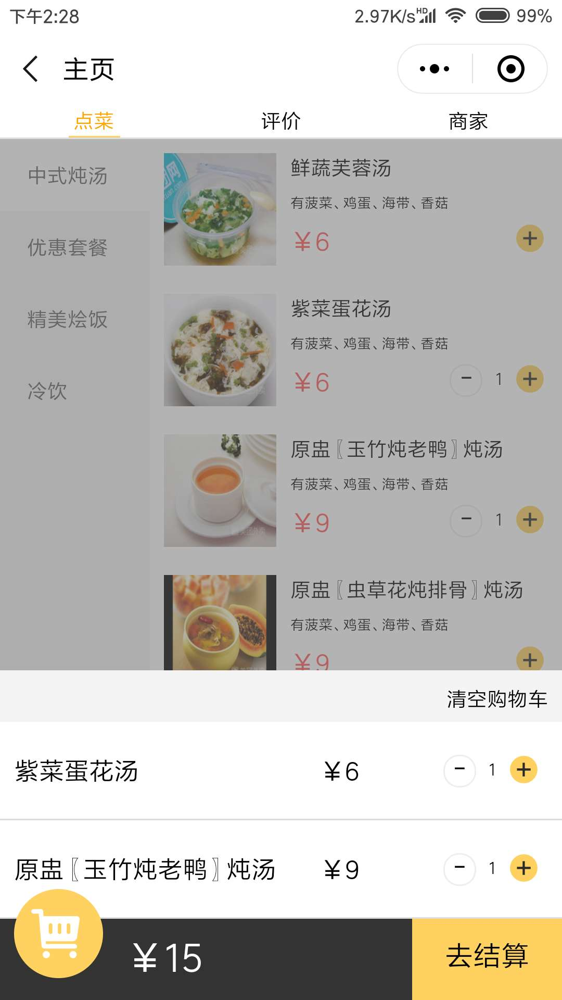

### 6. 结账

点击右下角【去结账，跳转订单详情页面

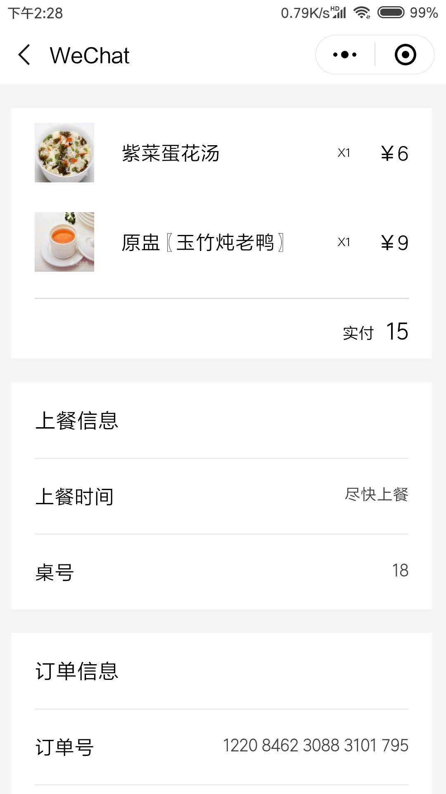

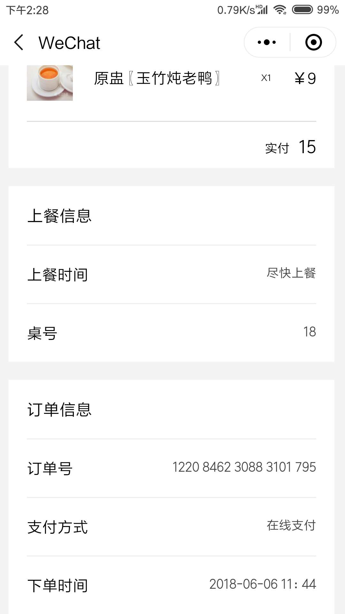

### 7. 查看评论

点击【评价，可查看该店铺的评价信息

### 8. 查看商家信息

点击【商家，可查看商家信息

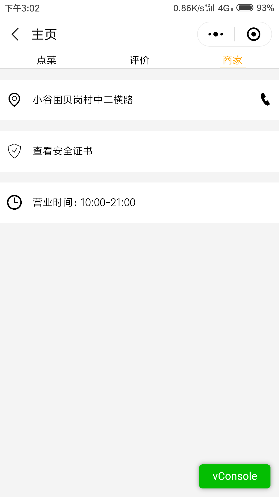
