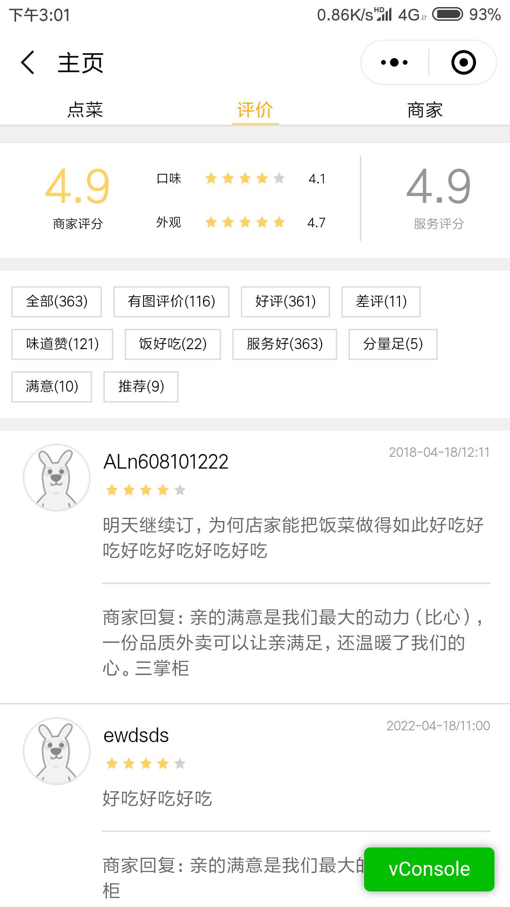

# 随心点餐宝用户手册

## 商家使用说明

### 1. 注册

### 2. 登录

### 3. 信息修改

### 4. 订单

#### 4.1. 查看全部订单

#### 4.2. 订单详情

### 5. 商品

#### 5.1. 查看商品

#### 5.2. 删除商品

#### 5.3. 添加商品

### 6. 说明

## 顾客使用说明

### 1. 主界面（食物列表）

#### 1.1. 类别一

#### 1.2. 类别二

### 2. 查看食物详情

### 3. 添加食物

### 4. 删除食物

### 5. 查看购物车

### 6. 结账

### 7. 查看评论

### 8. 查看商家信息

