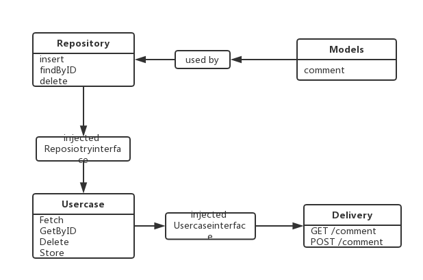

## [Dashboard](https://github.com/Canyonsysu/Dashboard)

此项目用于记录项目开发进度以及文档

[本项目博客主页](https://canyonsysu.github.io/Dashboard/)可以查看其他关键模型

**用例图**如下：

#### 扫码点餐系统用例图

[](https://github.com/CanyonSYSU/Dashboard/blob/master/assets/images/%E7%94%A8%E6%88%B7%E7%94%A8%E4%BE%8B%E5%9B%BE.PNG)

- 扫码进入：用户通过微信扫一扫扫描二维码进入到点餐界面
- 查看商家信息：用户可以查看商家的联系方式以及食品安全档案各种商家信息
- 查看评价：用户可以选择不同的评价分类查看评价
- 点菜：用户在菜品列单中选择自己需要的菜品以及数量，添加的菜品会被加入到购物车
- 管理购物车：用户可以在购物车里对已选择的菜品进行数量修改，或是清空购物车重新进行点菜
- 结算：用户在结算界面会有订单的详细内容，并可以对订单添加备注，在选择支付方式并完成支付后，用户可以对此次体验进行评价

#### 商家后台管理系统用例图

[](https://github.com/CanyonSYSU/Dashboard/blob/master/assets/images/sellerUsecase.png)

- 注册登录：商家用户需要在系统里注册用户，登录，才能使用商家后台管理系统
- 管理菜单：商家用户可以对菜单进行管理，可以查看到已添加的商品列表，可以添加商品、删除商品进行菜单的更新
- 管理订单：商家用户可以看到顾客提交的订单，对订单进行处理
- 商家信息管理：商家用户可以编辑自己的信息，包括店铺信息和系统账号信息

## [Integration](https://github.com/CanyonSYSU/Dashboard/blob/master/documents/7.4_Software_Architecture_Document.md)

此项目包含进行持续集成与部署，

自动化测试部署在[TravisCI](https://travis-ci.com/CanyonSYSU/Server)上

项目**部署图**如下：


请阅读本项目的[架构与部署方案](https://github.com/CanyonSYSU/Dashboard/blob/master/documents/7.4_Software_Architecture_Document.md)了解项目整体结构。

## [DatabaseServer](https://github.com/CanyonSYSU/Dashboard/blob/master/documents/7.2.1_Database_Design.md)

此项目包含数据库服务器的配置文件，数据库使用的是 MySQL，我们使用MysqlWorkbench制作了整个系统的**概念数据模型:**


## [Server](https://github.com/CanyonSYSU/Server)

我们架构选择的是简洁架构

### 原因
- 分层明确，易于维护和修改。
- 独立于框架，该架构不会依赖于某些功能强大的软件库存在。
- 独立于数据库，可以用 Mongo， BigTable， CouchDB 或者其他数据库来替换SQL Server，我们的业务规则不要绑定到数据库。

### 目录结构

```
canyonsysu/  
  check/        # 检查格式合法性
  data/         # 文件存储区
  db/           # 数据库操作         仓库层（ Repository )
  entity/       # 基本类            模型层（ Models ）
  loghelper/    # 日志系统
  README.md     # 项目说明文档        
  server/       # api层和server搭建  表现层（ Delivery ）
  service/      # dao层，服务层      用例层 ( Usecase )
  main.go       # 执行函数 

```
我们的简洁架构分为四层：

- 模型层（ Models ）：在这一层中将存储对象的结构和它的方法。Go中的实体是一组数据结构和功能。
- 仓库层（ Repository )：该层通常由框架和工具组成，如数据库，Web框架等。
- 用例层 ( Usecase )：该层中的软件包含特定于应用程序的业务规则。它封装并实现了系统的所有用例。
- 表现层（ Delivery ）：该层中的软件是一组适配器，可将数据从用例和实体最方便的格式转换为最适合某些外部机构（如Web）的格式。

### 架构图


#### 模型层（ Models ）
所有实体或者模型将会被存放在这一层。
例如在文件[entity/comment.go](https://github.com/CanyonSYSU/Server/blob/master/entity/comment.go)中，有我们的实体模型：
```
package entity

type Comment struct {
	ID            int    `xorm:"pk autoincr unique" json:"id"`
	Order_ID      int    `json:"order_id"`
	Username      string `json:"usr_name"`
	Buddha_src    string `json:"usr_photo"`
	Rate_at       string `json:"comment_at"`
	Rating_star   int    `json:"comment_star"`
	Tags          string `json:"tag"`
	Client_text   string `json:"client_text"`
	Merchant_text string `json:"merchant_text"`
}

type Tags struct {
	Tag string `json:"tag"`
	Count int `json:"count"`
}
```
#### 仓库层（ Repository ）
仓库将存放所有的数据库处理器，查询，创建或插入数据库的处理器将存放在这一层，该层仅对数据库执行 CRUD 操作。 该层没有业务流程。只有操作数据库的普通函数。

这层也负责选择应用中将要使用什么样的数据库。 可以是 Mysql， MongoDB， MariaDB，Postgresql，无论使用哪种数据库，都要在这层决定。

如果使用 ORM， 这层将控制输入，并与 ORM 服务对接。

在文件[db/storage.go](https://github.com/CanyonSYSU/Server/blob/master/db/storage.go#L206)中，我们有定义存储库的接口，其中实体将被存储，如：
```
package db

import "github.com/CanyonSYSU/Server/entity"

...
type CommentFilter func(*entity.Comment) bool

func QueryComment(filter CommentFilter) []entity.Comment {
	var comment []entity.Comment
	mfData := findAllCommentsDesc()
	for _, v := range mfData {
		if filter(&v) {
			comment = append(comment, v)
		}
	}
	return comment
}
...
```
这个接口可以在任何类型的存储层中实现，比如MongoDB，MySQL等等。在我们的项目中，我们使用MySQL来实现，如[comment_db.go](https://github.com/CanyonSYSU/Server/blob/master/db/comment_db.go#L63)中所示：
```
package db

import (
	_ "github.com/go-sql-driver/mysql"
)

func findAllCommentsDesc() []entity.Comment {
	sql := "select * from comment order by i_d desc"
	vec := make([]entity.Comment, 0)
	err := engine.Sql(sql).Find(&vec)
	if err != nil {
		loghelper.Error.Println(err)
	}
	return vec
}
...
```
#### 用例层（ Usecase ）
这层将会扮演业务流程处理器的角色。任何流程都将在这里处理。该层将决定哪个仓库层被使用。并且负责提供数据给服务以便交付。处理数据进行计算或者在这里完成任何事。

service包代表由简洁架构定义的用例层，里面有所有service接口和相关实现。例如[comment_service.go](https://github.com/CanyonSYSU/Server/blob/master/service/comment_service.go#L30)：
```
func ListAllCustomers() []entity.Customer {
	return db.QueryCustomer(func(u *entity.Customer) bool {
		return true
	})
}
...
```

#### 表现层（ Delivery ）
这一层将作为表现者。决定数据如何呈现。任何传递类型都可以作为是 REST API， 或者是 HTML 文件

这一层将接收来自用户的输入，并清理数据然后传递给用例层。

对于我们的项目，使用 REST API 作为表现方式。客户端将通过网络调用资源节点，表现层将获取到输入或请求，然后将它传递给用例层。

我们架构中的表现层实现在[server](https://github.com/CanyonSYSU/Server/tree/master/server)包的内容中：
```
$ cd server; tree
.
├── categorys_handler.go
├── comment_handler.go
├── customer_handler.go
├── menufood_handler.go
├── orderfood_handler.go
├── restaurant_handler.go
└── server.go
```
在下面的代码中，从server包中，我们可以看到如何使用这些服务：
[server.go](https://github.com/CanyonSYSU/Server/blob/master/server/server.go#L58)
```
package server
...
mx.HandleFunc("/v1/comments", ListAllCommentHandler(formatter)).Methods("GET")  //显示所有评论
```
[comment_handler.go](https://github.com/CanyonSYSU/Server/blob/master/server/comment_handler.go#L106)
```
package server
...
func ListServiceHandler(formatter *render.Render) http.HandlerFunc {
	return func(w http.ResponseWriter, req *http.Request) {
		formatter.JSON(w, 200, struct {
			Taste_score   float32 `json:"taste_score"`
			Sight_score   float32 `json:"sight_score"`
			Overall_score float32 `json:"overall_score"`
			Service_score float32 `json:"service_score"`
		}{Taste_score: 4.7, Sight_score: 4.7, Overall_score: 4.9, Service_score: 4.9})
	}
}
```

#### 用到的其他框架

| 框架         |                  源代码                   | 备注        |
| ---------- | :------------------------------------: | --------- |
| negroni    | https://github.com/codegangsta/negroni | 服务器框架     |
| mux        |     https://github.com/gorilla/mux     | URL路由和调度器 |
| render     |   https://github.com/unrolled/render   |           |
| simplejson | https://github.com/bitly/go-simplejson | json处理    |
| mysql      | https://github.com/go-sql-driver/mysql |           |
| xorm       |    https://github.com/go-xorm/xorm     | 数据库引擎     |

#### 拓展性
我们后台架构的扩展性是很好的。例如，如果我们想增加一个实体，只需要在entity包中添加一个类；把与其对应的数据库操作加到db包；再在service包增加与逻辑相关的组合操作；最后在server包中接受处理与系统外界的输入输出，调用service即可。

## [merchant-manage-system](https://github.com/CanyonSYSU/merchant-manage-system)

这部分是关于前端商家管理的搭建部分

### 目录结构

```
merchant-manager-system/  
  buid/          # 构建脚步目录 
  config/        # 构建配置目录
  node_modules/  # 依赖的node工具包目录
  src/           # 源码代码
    api/           # 网络请求api文档
    assets/        # 资源目录
    router/        # 路由目录
    config/        # 配置目录
    components/    # 项目页面组件
    store/         # 项目储存文件
    App.vue/       # 页面级组件
    main.js/       # 页面入口Js文件
  static/        # 静态文件目录 
  test/          # 测试文件目录
  README.md      # 项目说明文档  
```

使用element-ui的el-menu作为左侧导航栏，点击加载组件替换内容区的内容
```bash
<el-row class="content-wrapper">
  <transition name="fade" mode="out-in">
    <router-view></router-view>
  </transition>
</el-row>
```

使用api.js和fetch.js类封装网络请求

```bash
# 使用fetch.js封装网络请求
mport { baseUrl, loginImgUrl } from './env'
import Axios from 'axios'

let AxiosInstance = Axios.create()

export default async (url = '', data = {}, type = 'GET', credentials = false, loginImg = false) => {


```

```bash
#api.js封装api请求

export const login = data => fetch('/login', data, 'POST', true, true)
```


```bash
# 在login.vue引入login发起请求
import {login} from '@/api/getData'

const res = await login({username: this.loginForm.username, password: md5(this.loginForm.password)})
```

### 技术

#### 框架

| 框架         |                  源代码                   | 备注        |
| ---------- | :------------------------------------: | --------- |
| vue-cli    | https://github.com/vuejs/vue-cli | vue框架     |
| axios        |     https://github.com/axios/axios     | 一个基于 promise 的 HTTP 库,可以用在浏览器和 node.js 中 |
| vuex     |   https://github.com/vuejs/vuex   |  Vuex 是一个专为 Vue.js 应用程序开发的状态管理模式         |
| vue-router     |   https://github.com/vuejs/vue-router   |  路由管理器        |

#### axios
使用axios进行http访问
```bash
import { baseUrl, loginImgUrl } from './env'
import Axios from 'axios'
let AxiosInstance = Axios.create()
...
try {
    if (type === 'GET') {
      let response = await AxiosInstance({
        method: 'get',
        url: url
      })
      return response
    }
  } catch (err) {
    throw new Error(err)
  }

```

#### vuex
使用vuex作为应用程序开发的状态管理模式
```bash
import Vue from 'vue'
import Vuex from 'vuex'
import {getUserInfo} from '@/api/getData'
// import dialog_store from '../components/dialog_store.js';//引入某个store对象

Vue.use(Vuex)

export default new Vuex.Store({
  state: {
    adminInfo: {
      avatar: 'default.jpg'
    }
  },
  mutations: {
    saveAdminInfo (state, adminInfo) {
      state.adminInfo = adminInfo.data
    }
  },
  actions: {
    async getAdminData ({commit}) {
      try {
        const res = await getUserInfo()
        if (res.data.status === 1) {
          commit('saveAdminInfo', res.data)
          return true
        } else {
          console.log('您尚未登陆或者session失效')
        }
      } catch (err) {
        console.log(err)
        console.log('您尚未登陆或者session失效')
      }
      return false
    }
  },
  getters: {}
})

```

#### vue-router
使用vue-router作为路由管理器
```bash
import Vue from 'vue'
import Router from 'vue-router'
import Home from '@/components/home'
// import Dish from '@/components/dish'
import Indent from '@/components/Indent'
import AddGoods from '@/components/addGoods'
import ReduceGood from '@/components/reduceGood'
import Manager from '@/components/manager'
import Declare from '@/components/declare'
import DishCard from '@/components/dish_card'
import register from '@/components/register'
import Login from '@/components/login'
import MerchantInfo from '@/components/merchantInfo'

Vue.use(Router)

export default new Router({
  routes: [
    {
      path: '/DataManage',
      name: '数据管理',
      redirect: '/dish',
      component: Home,
      iconCls: 'el-icon-document',
      children: [
        { path: '/dish', component: DishCard, name: '食品列表' },
        { path: '/indent', component: Indent, name: '订单列表' }
      ]
    },
    {
      path: '/addData',
      name: '增删数据',
      component: Home,
      iconCls: 'el-icon-tickets',
      children: [
        { path: '/addGoods', component: AddGoods, name: '添加商品' },
        { path: '/reduceGood', component: ReduceGood, name: '删除商品' }
      ]
    },
    {
      path: '/set',
      name: '设置',
      component: Home,
      iconCls: 'el-icon-setting',
      children: [
        { path: '/manager', component: Manager, name: '管理员设置' }
      ]
    },
```

## [Client2.0](https://github.com/CanyonSYSU/Client2.0)

微信小程序客户端

### 目录结构

```
Client2.0/  
  images/              # 图片文件 
  pages/               # 页面文件
  utils/               # 帮助类文件
  app.js               # 小程序逻辑 
  app.json             # 小程序公共设置
  app.wxss             # 小程序公共样式表  
  project.config.json  # 工具配置
```

使用顶部导航栏和swiper切换不同的页面
```bash
<import src="../template/evaluate.wxml" />
<import src="../template/order_page.wxml" />
<import src="../template/merchant.wxml" />
<import src="../template/indent.wxml" />
<view class="container">
  <view class="header">
    <block wx:for="{{swiper_title}}" wx:key="">
      <view class="title {{index==currentPage?'selected':''}}" data-index="{{index}}" bindtap='swiper_click'>{{item.text}}</view>
    </block>
  </view>

  <swiper class="swiper" current="{{currentPage}}" bindchange="turnTitle">
    <swiper-item id="orderPage">
      <template is="order_page" data="{{categorys, categoryTap, category_select, order_menu, account_num, dish_detail, trolley_list, gray_backgroud_hidden, trolley_hidden}}"/>
    </swiper-item>
    <swiper-item id="evaluate_page">
      <template is="evaluate_page" data="{{merchant_comment_score, evaluate_tags, client_evaluate}}"/>
    </swiper-item>
    <swiper-item id="indent">
      <template is="indent" data="{{indent_list}}"/>
    </swiper-item>
    <swiper-item id="merchant">
      <template is="merchant_page" data="{{merchant_information}}"/>
    </swiper-item>
  </swiper>
</view>
```

util帮助类封装日期转换和post表单编码函数
```bash
const formatTime = date => {
  const year = date.getFullYear()
  const month = date.getMonth() + 1
  const day = date.getDate()
  const hour = date.getHours()
  const minute = date.getMinutes()
  const second = date.getSeconds()

  return [year, month, day].map(formatNumber).join('/') + ' ' + [hour, minute, second].map(formatNumber).join(':')
}

const formatNumber = n => {
  n = n.toString()
  return n[1] ? n : '0' + n
}

const json2Form = function (json) {
  var str = [];
  for (var p in json) {
    console.log(json[p])
    str.push(encodeURIComponent(p) + "=" + encodeURIComponent(json[p]));
  }
  return str.join("&");
} 

module.exports = {
  formatTime: formatTime,
  json2Form: json2Form
}

```

### 技术

#### 框架

| 框架         |                  源代码                   | 备注        |
| ---------- | :------------------------------------: | --------- |
| 微信小程序    |   | 微信小程序框架     |

使用wx.request发起请求
```bash
  #获取商家信息
  get_merchant_information() {
    var that = this;
    wx.request({
      url: "http://192.168.43.147:7070/v1/restaurants?name",
      success: function (res) {
        that.setData({
          merchant_information: res.data[0]
        })
      }
    })
  },
```

使用wx.navigateTo进行跳转
```bash
to_indent_evaluate: function (e) {
    wx.navigateTo({
      url: '../indent_evaluate/indent_evaluate?formId'
    })
  },
```
