# 饿了么 - 点外卖业务描述

## 概述
准时必达，超时赔付，甄选资质齐全，卫生可靠的优质商家，提供高品质外卖服务。
网罗周边各类外卖，各类特价优惠套餐、满减折扣优惠、立减优惠套餐，便捷生活，一手掌握，尽在饿了么！

特色功能
- 搜索附近外卖美食，预约订餐；
- 及时通知外卖状态，准时送达；
- 智能筛选排序餐厅，方便点餐；
- 各种赠饮打折活动，优惠不断；
- 外卖美食照片点评，吃出乐趣；
- 积分商城兑换豪礼，兑出惊喜； 

## 点外卖业务
1. 主页，自动定位或者个人选择当前精确位置，然后往下拉即可显示附近商家列表

  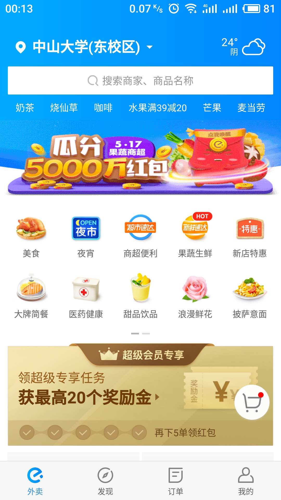
  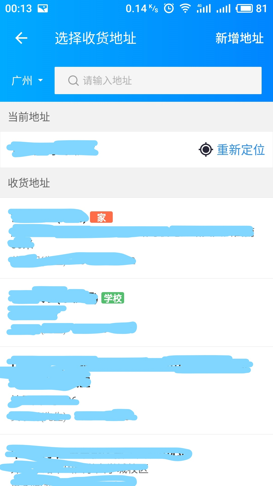
  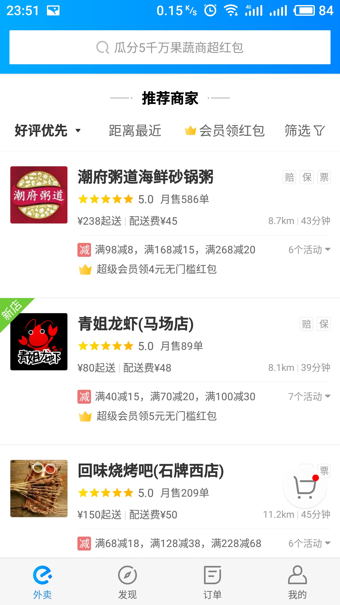

2. 根据个人喜好对商家筛选并排序

  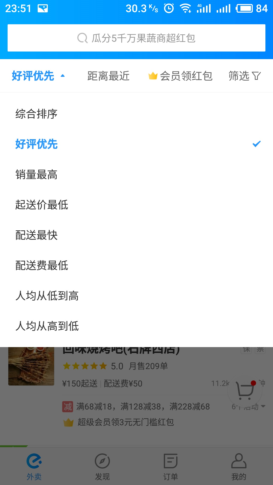

3. 选择进入某商家页面，显示分类菜单

  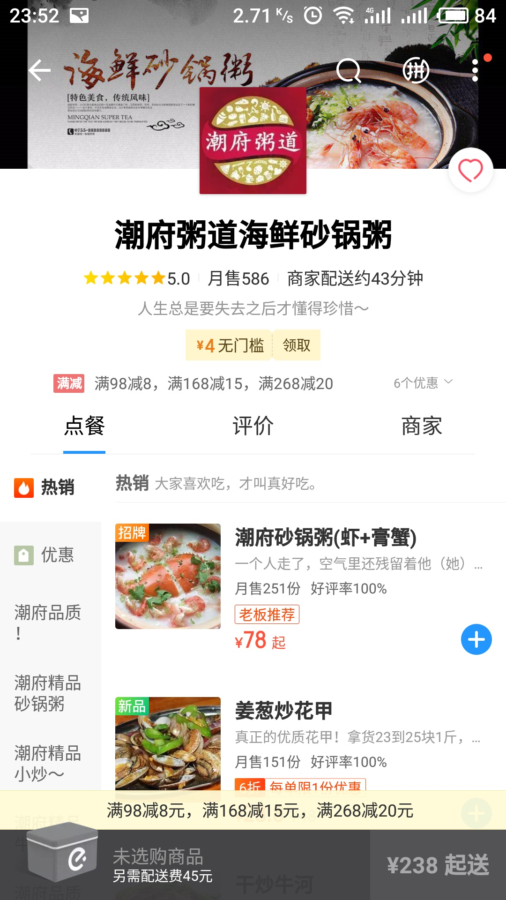

4. 根据左侧选择不同菜类，然后再选择菜品添加进购物车，可在购物车中对已选菜品进行管理

  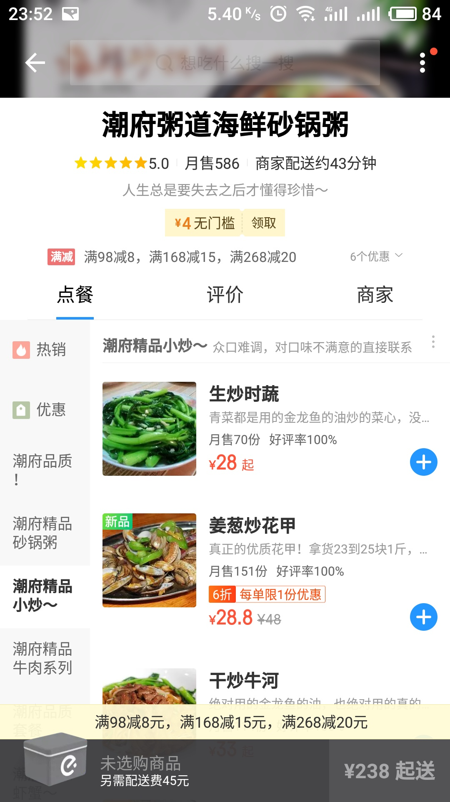
  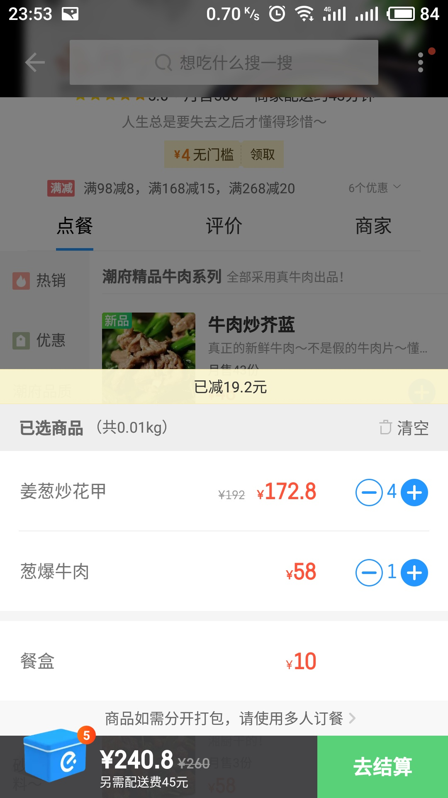

5. 去结算，需要完善送货地址，送货地址可以从以往保存的地址列表选择，也可以使用新增地址；选择支付方式，目前提供5种在线支付途径

  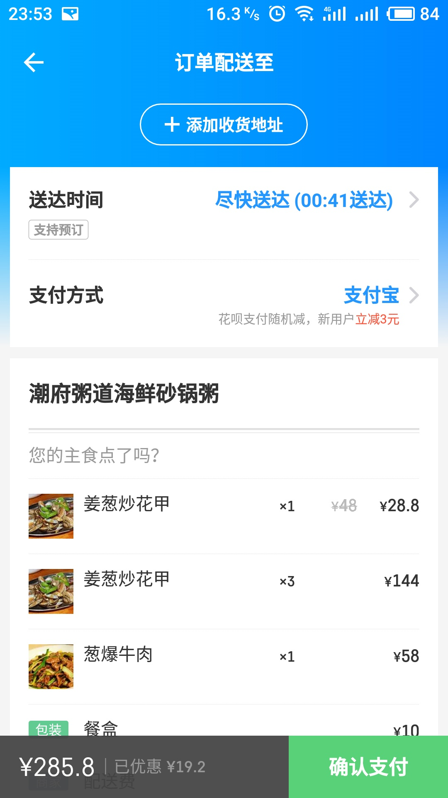
  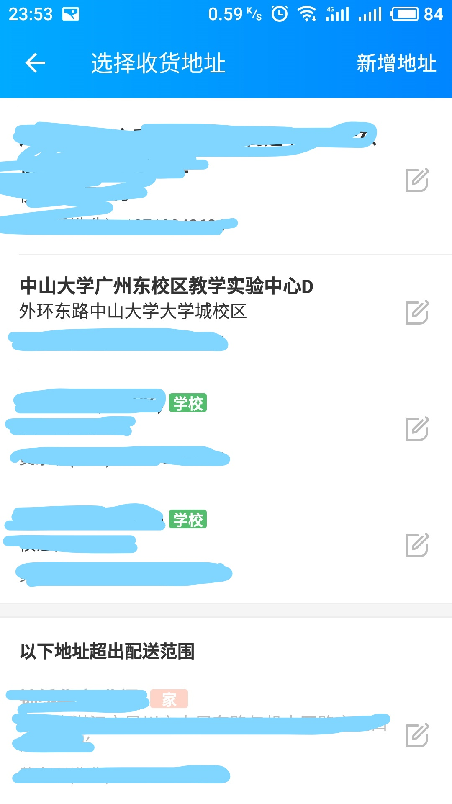
  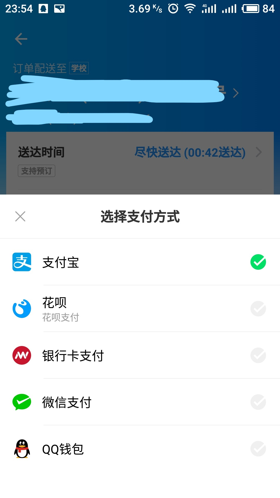

6. 点击立即付款并输入密码后即完成下单流程(也可以选择取消支付，订单会进入待支付状态十五分钟，超时后订单自动取消)

  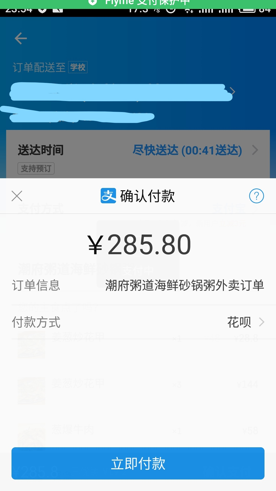

7. 查看订单状态【待支付/已取消/已送达/配送中】，根据订单状态执行支付/评论/催单的操作，还可以电联商家

  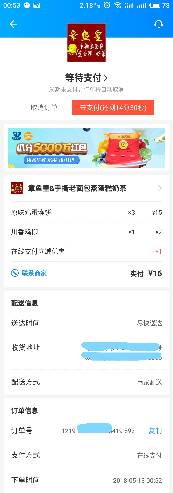
  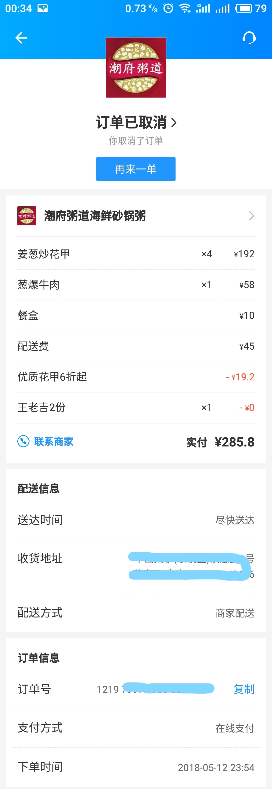
  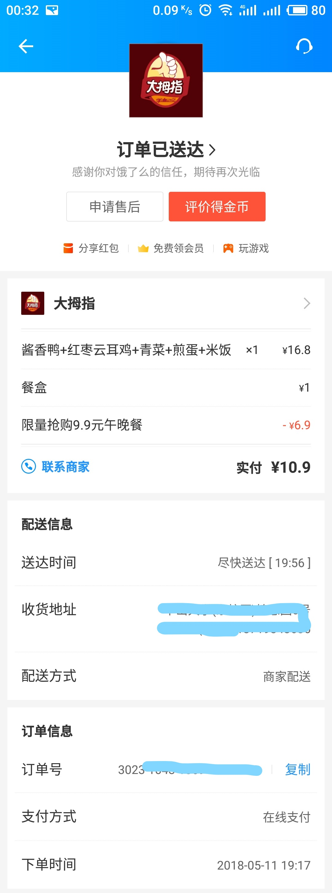

